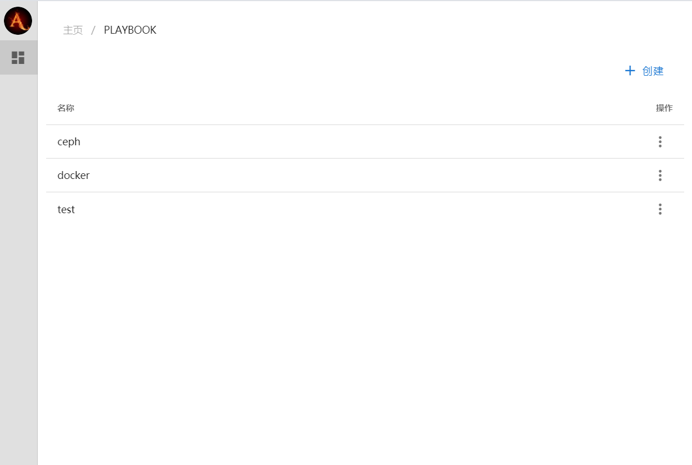

# GoAnsible

使用golang 编写， 实现 ansible playbook 部分功能，安装起来更简单，目的不在于替换ansible，而是代替某些复杂shell脚本（特别多机部署）。并且从 `V0.0.2` 开始提供桌面客户端。


**Playbook 管理界面**



**运行日志**


## 编译

```

cd cmd/playbook/

go build -v

```

## 使用

### 运行playbook

```

playbook --workdir <your playbook dir> --tag <your tag1>,<your tag2>

```

### 运行批量命令

```
playbook run <group name> "<shell command>" [--workdir <your inventory dir>] 

```


### 编译桌面客户端

`windows`

```
cd cmd/desktop/

go build -ldflags "-s -w -H=windowsgui"

```

`linux`

```
cd cmd/desktop/

go build  -v

```


## 使用教程

playbook格式跟 ansible playbook非常相似，但 goansible 没有role 功能，模板由 jinja2 变为 go 的 template

inventory 从0.0.2版本开始使用 yaml 格式定义，定义主机属性和分组以及自定义变量

### inventory

```yaml

groups:
  all:
    host1:
      ansible_ssh_host: "192.168.1.100"
      ansible_ssh_port: "22"
      ansible_ssh_user: root
      ansible_ssh_pass: "123456"
      ansible_ssh_key: ""
    host2:
      ansible_ssh_host: "192.168.1.101"
      ansible_ssh_port: "22"
      ansible_ssh_user: root
      ansible_ssh_pass: "123456"
      ansible_ssh_key: ""
  test:
     host1: {}
     host2: {}
vars: 
  key1: value1

```

- groups： 定义主机属性和分组

- vars： 自定义变量，可以通过 `{{ .Values.key1 }}` 获取 


### playbook

```yaml
- name: import playbook
  import_playbook: import.yaml
  tag: tag1,tag2

- name: example playbook
  hosts: test
  vars:
    d: b
  include_values:
    - values.yaml
  tasks:
    - name: echo
      shell: echo helloworld
```

上面例子描述了一playbook 结构：

* name: playbook 的名字，这是可以随便取

* import_playbook：导入另一个playbook 内容

* hosts： 主机，目前仅支持 group name

* vars: 自定义变量

* include_values：使用包含自定义变量文件，这个跟vars 合并，并重复的话会覆盖vars

* tasks： 包含一组任务

* tag：标签过滤，多个标签使用","分割，

### task

```yaml
- name: shell command
  shell: echo helloword > hello
- name: copy file
  file:
    src: test.file
    dest: /tmp/test.file
- name: parse template file
  template:
    src: test.tpl
    dest: /tmp/test.tpl
```

一、变量和函数

goansible 分为三种种变量，一种全局变量values; 一种是主机变量hostvars；还有当前组所有主机变量groupvars （hostvars 是 groupvars 一个成员）。

在模板中使用：`{{ .Values.xxx }}`、  `{{ .HostVars.xxx }}`、 `{{ .GroupVars.hostname.xxx }}`

在赋值中使用： `values.xxx`、 `hostvars.xxx` 、`groupvars.hostname.xxx`

goansible 内置部分函数：

- join: 将数组合并成字符串，`{{ join .Values.testArray  "," }}`

- join_groupvars: 将某个组里hostvar合并成字符串，`{{ join_groupvars  .GroupVars ansible_ssh_host ","}}`

- plus: 加，`{{ plus .Values.a  .Values.b }}`

- minus: 减，`{{ minus  .Values.a  .Values.b }}`

二、循环

```yaml

- name: loop
  shell: echo {{ .Item }}
  loop:
    - a
    - b
- name: loop values
  shell: echo {{ .Item.xxx }}
  loop: values.loops

```

三、条件

```yaml
- name: when
  shell: echo "I am master"
  when: hostvars.k8s_master

```

四、获取执行结果

```yaml

- name: stdout
  shell: echo "stdout result"
  stdout: hostvars.stdout

```

五、打印变量

```yaml
- name: stdout
  shell: echo "stdout result"
  stdout: hostvars.stdout
  debug: {{ .HostVars.stdout }}

```

六、忽略错误

```yaml

- name: stdout
  shell: errcmd
  ignore_error: true

```

七、包含其他task文件

```yaml
- name: include task
  include: task.yaml

```

八、 标签

```yaml
- name: tag test
  shell: do something
  tag: tag1,tag2

```

运行时设置标签： 

```
./playbook -tag tag1,tag2

```

九、操作

1、shell

```yaml
- name: shell command
  shell: echo helloword > hello

- name: 使用变量模板
  shell: echo {{ .Values.test }}

```

* shell: 执行的命令

2、file

```yaml
- name: copy file
  file:
    src: test.file
    dest: /tmp/test.file
    mode: "0644"
    owner: root
    group: root

```

复制文件到目标机器

* src: 源文件（本地文件）路径

* dest: 目标文件路径

* mode: 文件权限，默认`0644`

* owner: 文件用户，默认ssh 用户

* group: 文件用户组，默认ssh 用户组

3、template

```yaml
- name: copy file
  template:
    src: test.file
    dest: /tmp/test.file
    mode: "0755"
    owner: root
    group: root

```

根据模板生成文件，并复制文件到目标机器

* src: 源文件（本地文件）路径

* dest: 目标文件路径

* mode: 文件权限，默认`0644`

* owner: 文件用户，默认ssh 用户

* group: 文件用户组，默认ssh 用户组

4、directory

```yaml

- name: directory
  directory:
    path: /tmp/456
    mode: "0755"
    owner: root
    group: root

```

新建文件夹

* path: 文件夹路径

* mode: 文件权限，默认`0755`

* owner: 文件用户，默认ssh 用户

* group: 文件用户组，默认ssh 用户组

5、regexp

```yaml

- name: regexp
  regexp:
    src: abrrrc
    exp: a(b{1})r(r{2})c
    dst: values.reg.ddd

```

```yaml

- name: regexp
  regexp:
    src: abrrrc
    exp: ","
    dst: values.reg.ddd
    split: true

```

根据正则表达式匹配分割，并保存结果到变量中

* src: 源字符串

* exp: 正则表达式

* dst: 保存结果变量名

* split: 分割

6、until

```yaml
- name: demo until
  until:
    shell: "ss -lnp|awk '{print $5}'|grep  -n :3000$"
    match: ".+"
    timeout: 300
    interval: 10
```

循环执行命令，直到匹配到结果

* shell: 执行shell命令

* match: 对执行的命令输出结果匹配的正则表达式

* timeout: 超时时间，默认300s

* interval: 循环执行命令间隔，默认5s

7、cert 证书生成

```yaml
- name: 生成CA
  cert:
    crt_path: root.crt
    key_path: root.key
    is_ca: "true"
    country: CN
    organization: k8s
    organizational_unit: opsnull
    expires: 100y
- name: 生成证书
  cert:
    root_crt_path: root.crt
    root_key_path: root.key
    crt_path: test.crt
    key_path: test.key
    is_ca: "false"
    common_name: kubernetes-master
    country: CN
    organization: k8s
    organizational_unit: opsnull
    expires: 100y
    ip_addresses: "127.0.0.1,192.168.1.1"
    domains: "localhost"
```

8、curl

```yaml
- name: curl请求
  curl:
    url: http://127.0.0.1
    option: 
      request: POST
      header: "Content-Type:application/json"
      data: |
        {"hello":"world"}
- name: curl请求 yaml to json
  curl:
    url: http://127.0.0.1
    options: 
      request: POST
      header: "Content-Type:application/json"
      data-yaml: |
        hello: world   
```

- url: 请求地址

- options: 和 curl 命令参数相同，可以使用curl --help 查看，新增 data-yaml，使用yaml 编写格式


